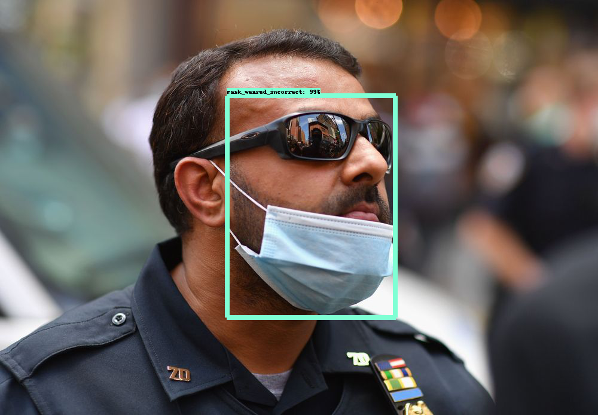

<b> About the project </b>

Wearing mask is the most effective way to control the spread of Corona virus. Face mask detector applications are in high demand especially to monitor public places like public marketplaces, public offices, malls, government buildings etc  This project aims to create an efficient Face Mask detector application based on deep neural network.

 

<b> Dataset used for training </b>

I have used the data from [Face Mask Detection](https://www.kaggle.com/andrewmvd/face-mask-detection/activity) dataset from Kaggle. The dataset contained annotated images with 3 classes:
    
1. with mask
2. without mask
3. mask worn incorrectly

The dataset contains total of 853 images along with annotations in PASCAL VOC format.

<b> Technolgy stack used </b>

1. [OpenCV](https://opencv.org/) 
2. [TensorFlow 2 Object Detection API](https://github.com/tensorflow/models/tree/master/research/object_detection)
3. [EfficientDet-SSD based Face Mask detector](https://tfhub.dev/tensorflow/efficientdet/d1/1)
4. [Python](https://www.python.org/)

<b> Prerequisites </b>

All the dependencies and required libraries are included in the file _requirements.txt_.

<b> Model Training </b>

The repo contains ssd efficientdet model trained with 20,000 iterations using Google Colab. You can also refer to [my colab notebook](https://colab.research.google.com/drive/1tGTuIg2xJipoln8IC8cxH35Wr4nJ7930?usp=sharing), where I have tried to explain step by step flow for performing model training using Tensorflow2 object detection API. 

<b> Installation </b>

1. Clone the repo using following command 
    
        $ git clone https://github.com/coolmunzi/face_mask_detector.git
2. Create a virtual environment and change the directory to the cloned repo
3. Change your directory to the cloned repo and create a Python virtual environment named 'test'
4. Install the dependencies using following command
    
        $pip install -r requirements.txt
5. To perform face mask detection on images:
    
        $python face_mask_detector.py --type image --input {Path to directory containing images} --output {Path to directory where you want to store the images with predictions}
   
6. To perform face mask detection on webcam:
    
        $python face_mask_detector.py --type video --input webcam

